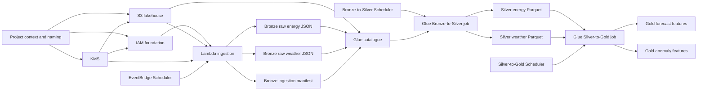
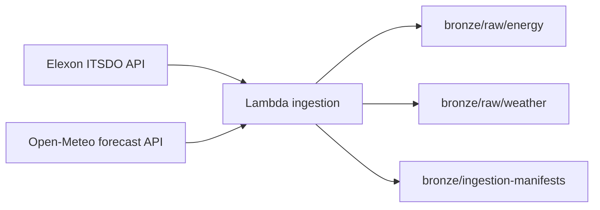
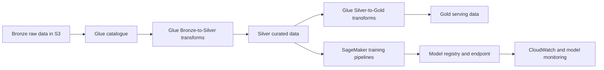

# AWS Real-Time Energy Forecasting And Anomaly Detection

Production-style AWS MLOps project built around near-real-time public energy-demand and weather ingestion, a Bronze/Silver/Gold lakehouse on Amazon S3, and modular Terraform-first infrastructure.

This repository currently covers:

1. shared Terraform deployment context and naming
2. KMS-backed encryption
3. S3 lakehouse buckets and starter Bronze or Silver or Gold prefixes
4. IAM foundation roles for Lambda, Glue, and SageMaker
5. a real ingestion Lambda that fetches public Elexon and Open-Meteo data
6. EventBridge Scheduler orchestration for recurring ingestion
7. a Glue catalogue database and Bronze external tables
8. a Glue Bronze-to-Silver transformation job
9. automated scheduling for recurring Bronze-to-Silver Glue runs
10. a Glue Silver-to-Gold transformation job for model-ready features
11. automated scheduling for recurring Silver-to-Gold Glue runs
12. helper deploy and destroy scripts that auto-wire Terraform outputs forward

## Table Of Contents

- [Overview](#overview)
- [Workflow Diagrams](#workflow-diagrams)
- [Repository Structure](#repository-structure)
- [AWS Prerequisites](#aws-prerequisites)
- [Windows AWS CLI Setup](#windows-aws-cli-setup)
- [Git And GitHub Setup](#git-and-github-setup)
- [Configuration And Naming Strategy](#configuration-and-naming-strategy)
- [Terraform Module Workflow](#terraform-module-workflow)
- [Deploy And Destroy Commands](#deploy-and-destroy-commands)
- [Current Bronze Ingestion Behaviour](#current-bronze-ingestion-behaviour)
- [Glue Catalogue Notes](#glue-catalogue-notes)
- [Source Data Notes](#source-data-notes)
- [Example Bronze Outputs](#example-bronze-outputs)
- [Verification Commands](#verification-commands)
- [Troubleshooting Notes](#troubleshooting-notes)
- [Current Scope And Next Steps](#current-scope-and-next-steps)
- [References](#references)

## Overview

<details open>
<summary>Show or hide section</summary>

The project is intended to become a realistic AWS portfolio implementation for:

- energy-demand forecasting
- anomaly detection
- uncertainty-aware scenario analysis

The architecture is intentionally being built in disciplined stages rather than all at once.

What exists now:

- `terraform/01_project_context`
  creates a shared deployment identity such as `energyops-dev-creative-antelope`
- `terraform/02_kms`
  creates a customer-managed KMS key and alias
- `terraform/03_s3_lakehouse`
  creates the lakehouse, artefact, and monitoring buckets
- `terraform/04_iam_foundation`
  creates base execution roles for Lambda, Glue, and SageMaker
- `terraform/05_lambda_ingestion`
  packages and deploys a Python ingestion Lambda
- `terraform/06_eventbridge_scheduler`
  creates a recurring schedule that invokes the ingestion Lambda every 30 minutes by default
- `terraform/07_glue_catalog`
  registers the Bronze raw energy, weather, and ingestion-manifest locations in the Glue Data Catalog
- `terraform/08_glue_bronze_to_silver_job`
  uploads the Glue ETL script and creates the first Bronze-to-Silver transformation job
- `terraform/09_glue_bronze_to_silver_scheduler`
  creates a recurring schedule that starts the Bronze-to-Silver Glue job automatically
- `terraform/10_glue_silver_to_gold_job`
  uploads the Gold-layer ETL script and creates the first Silver-to-Gold transformation job
- `terraform/11_glue_silver_to_gold_scheduler`
  creates a recurring schedule that starts the Silver-to-Gold Glue job automatically

The Gold job writes two initial model-facing datasets:

- `gold/forecast_features/`
  joined demand-and-weather features for forecasting experiments
- `gold/anomaly_features/`
  rolling-statistics features intended for anomaly detection experiments

The current orchestration model is cadence-based:

- the ingestion Lambda runs on a recurring schedule
- the Bronze-to-Silver Glue job also runs on a recurring schedule

This means the transformation job is not yet triggered by the completion of a
specific Lambda invocation. Instead, each scheduled Glue run processes whatever
Bronze data is available at that point in time.

The ingestion path is now real rather than placeholder-only.

On each successful invocation, the Lambda:

1. calls the Elexon public demand endpoint
2. calls the Open-Meteo weather endpoint
3. writes the raw energy JSON into Bronze S3
4. writes the raw weather JSON into Bronze S3
5. writes a manifest describing the invocation and the stored object locations

The design goal is to preserve raw upstream payloads first, then add Glue catalogue and transformation layers on top of stable Bronze storage.

</details>

## Workflow Diagrams

<details open>
<summary>Show or hide section</summary>

Current infrastructure and ingestion workflow:



Current Bronze ingestion data flow:



Target future platform direction:



</details>

## Repository Structure

<details>
<summary>Show or hide section</summary>

```text
AWS-MLOps-EnergyForecasting-AnomalyDetection/
|-- .github/
|   `-- workflows/
|       `-- ci.yml
|-- lambda/
|   `-- ingestion/
|       `-- app.py
|-- glue/
|   `-- jobs/
|       |-- bronze_to_silver.py
|       `-- silver_to_gold.py
|-- scripts/
|   |-- deploy.py
|   `-- destroy.py
|-- src/
|   `-- energy_forecasting/
|       |-- __init__.py
|       |-- config/
|       |   |-- __init__.py
|       |   `-- settings.py
|       |-- ingestion/
|       |   |-- __init__.py
|       |   `-- public_sources.py
|       |-- ml/
|       |   |-- __init__.py
|       |   `-- pipeline.py
|       |-- orchestration/
|       |   `-- __init__.py
|       `-- transformation/
|           |-- __init__.py
|           `-- bronze_to_silver.py
|-- terraform/
|   |-- 01_project_context/
|   |   |-- main.tf
|   |   |-- outputs.tf
|   |   |-- terraform.tfvars.example
|   |   `-- variables.tf
|   |-- 02_kms/
|   |   |-- main.tf
|   |   |-- outputs.tf
|   |   |-- terraform.tfvars.example
|   |   `-- variables.tf
|   |-- 03_s3_lakehouse/
|   |   |-- main.tf
|   |   |-- outputs.tf
|   |   |-- terraform.tfvars.example
|   |   `-- variables.tf
|   |-- 04_iam_foundation/
|   |   |-- main.tf
|   |   |-- outputs.tf
|   |   |-- terraform.tfvars.example
|   |   `-- variables.tf
|   |-- 05_lambda_ingestion/
|   |   |-- main.tf
|   |   |-- outputs.tf
|   |   |-- terraform.tfvars.example
|   |   `-- variables.tf
|   |-- 06_eventbridge_scheduler/
|       |-- main.tf
|       |-- outputs.tf
|       |-- terraform.tfvars.example
|       `-- variables.tf
|   |-- 07_glue_catalog/
|       |-- main.tf
|       |-- outputs.tf
|       |-- terraform.tfvars.example
|       `-- variables.tf
|   |-- 08_glue_bronze_to_silver_job/
|       |-- main.tf
|       |-- outputs.tf
|       |-- terraform.tfvars.example
|       `-- variables.tf
|   |-- 09_glue_bronze_to_silver_scheduler/
|       |-- main.tf
|       |-- outputs.tf
|       |-- terraform.tfvars.example
|       `-- variables.tf
|   |-- 10_glue_silver_to_gold_job/
|       |-- main.tf
|       |-- outputs.tf
|       |-- terraform.tfvars.example
|       `-- variables.tf
|   `-- 11_glue_silver_to_gold_scheduler/
|       |-- main.tf
|       |-- outputs.tf
|       |-- terraform.tfvars.example
|       `-- variables.tf
|-- tests/
|   |-- test_bronze_to_silver_job.py
|   |-- test_lambda_ingestion.py
|   |-- test_public_sources.py
|   `-- test_settings.py
|-- .env.example
|-- .gitignore
|-- pyproject.toml
`-- README.md
```

Current core files:

- `scripts/deploy.py`
  orchestrates Terraform applies in dependency order and auto-writes live `terraform.tfvars`
- `scripts/destroy.py`
  destroys Terraform modules in reverse dependency order
- `lambda/ingestion/app.py`
  real ingestion handler that fetches energy and weather JSON, stores raw Bronze payloads, and writes a manifest
- `terraform/01_project_context/main.tf`
  generates the shared deployment name and common tags
- `terraform/02_kms/main.tf`
  provisions the KMS key and alias used by later modules
- `terraform/03_s3_lakehouse/main.tf`
  provisions the S3 lakehouse, artefact, and monitoring buckets
- `terraform/04_iam_foundation/main.tf`
  provisions base IAM roles for Lambda, Glue, and SageMaker
- `terraform/05_lambda_ingestion/main.tf`
  packages and deploys the ingestion Lambda
- `terraform/06_eventbridge_scheduler/main.tf`
  creates the recurring scheduler and Lambda invocation permission
- `terraform/07_glue_catalog/main.tf`
  registers the Bronze S3 locations as Glue database tables for downstream transformation work
- `terraform/08_glue_bronze_to_silver_job/main.tf`
  uploads the Glue ETL script and creates the first Silver transformation job
- `terraform/09_glue_bronze_to_silver_scheduler/main.tf`
  creates the recurring EventBridge Scheduler schedule that starts the Bronze-to-Silver Glue job
- `glue/jobs/bronze_to_silver.py`
  reads Bronze catalogue tables, flattens the raw structures, and writes Silver Parquet datasets
- `terraform/10_glue_silver_to_gold_job/main.tf`
  uploads the Gold-layer ETL script and creates the first Gold feature-engineering job
- `glue/jobs/silver_to_gold.py`
  reads Silver datasets, aligns energy and weather features, and writes Gold forecasting and anomaly datasets
- `terraform/11_glue_silver_to_gold_scheduler/main.tf`
  creates the recurring EventBridge Scheduler schedule that starts the Silver-to-Gold Glue job

The README is the canonical setup and usage guide.

</details>

## AWS Prerequisites

<details>
<summary>Show or hide section</summary>

You need:

- an AWS account
- AWS CLI v2
- Terraform `>= 1.5`
- Python `>= 3.10`
- permission to create or update:
  - KMS keys
  - S3 buckets
  - IAM roles and policies
  - Lambda functions
  - EventBridge Scheduler schedules

Basic checks:

```powershell
aws --version
terraform version
python --version
aws sts get-caller-identity
```

If IAM Identity Center is not enabled, configure the AWS CLI with an IAM user access key:

```powershell
aws configure
aws sts get-caller-identity
```

When prompted by `aws configure`, enter:

- `AWS Access Key ID`
- `AWS Secret Access Key`
- `Default region name`, for example `us-east-1`
- `Default output format`, for example `json`

</details>

## Windows AWS CLI Setup

<details>
<summary>Show or hide section</summary>

The project currently assumes a local Windows PowerShell workflow.

Check whether the AWS CLI is on `PATH`:

```powershell
aws --version
```

If it is not installed:

```powershell
winget install Amazon.AWSCLI
```

or:

```powershell
msiexec.exe /i https://awscli.amazonaws.com/AWSCLIV2.msi
```

Verify the logged-in identity:

```powershell
aws sts get-caller-identity
```

The repository currently uses a local `.env` file to drive deployment defaults.

Example:

```env
AWS_REGION=us-east-1
PROJECT_ENV=dev
PROJECT_NAME=Real-Time Energy Forecasting and Anomaly Detection
PROJECT_SLUG=energy-forecast
RESOURCE_PREFIX=energyops
OWNER=portfolio
COST_CENTRE=mlops-lab
```

The helper scripts read that file before generating `terraform.tfvars`.

</details>

## Git And GitHub Setup

<details>
<summary>Show or hide section</summary>

Typical local folder for this repository:

```text
C:\Users\HP\OneDrive\Documents\Projects\AWS\AWS-MLOps-EnergyForecasting-AnomalyDetection
```

Connect an existing folder to GitHub:

```powershell
git init
git remote add origin <YOUR_GITHUB_REMOTE_URL>
git branch -M main
git pull origin main
```

Check your current branch:

```powershell
git branch --show-current
```

Typical push flow:

```powershell
git add <FILES_OR_FOLDERS>
git commit -m "Describe the infrastructure or code change"
git push origin main
```

This repository has been developed incrementally by staging one Terraform module or code slice at a time.

</details>

## Configuration And Naming Strategy

<details>
<summary>Show or hide section</summary>

The naming seed is created by `terraform/01_project_context`.

It combines:

- `RESOURCE_PREFIX`
- `PROJECT_ENV`
- a generated animal-style suffix from `random_pet`

Example:

```text
energyops-dev-creative-antelope
```

That shared deployment name then flows into later resource names:

- `alias/kms-energyops-dev-creative-antelope`
- `dl-energyops-dev-creative-antelope`
- `iam-lambda-energyops-dev-creative-antelope`
- `lambda-ingest-energyops-dev-creative-antelope`
- `scheduler-ingestion-energyops-dev-creative-antelope`

The common tag set also starts in `01_project_context` and is reused downstream.

Important note:

- the random suffix stays stable as long as the Terraform state for `01_project_context` remains intact
- if that module is destroyed and recreated, the generated suffix will change

</details>

## Terraform Module Workflow

<details>
<summary>Show or hide section</summary>

The current module dependency chain is:

1. `01_project_context`
2. `02_kms`
3. `03_s3_lakehouse`
4. `04_iam_foundation`
5. `05_lambda_ingestion`
6. `06_eventbridge_scheduler`
7. `07_glue_catalog`
8. `08_glue_bronze_to_silver_job`
9. `09_glue_bronze_to_silver_scheduler`
10. `10_glue_silver_to_gold_job`
11. `11_glue_silver_to_gold_scheduler`

Why this order matters:

- KMS depends on deployment context
- S3 depends on KMS for encryption
- IAM depends on both S3 and KMS ARNs
- Lambda depends on IAM, S3, and KMS
- Scheduler depends on the Lambda name and ARN
- Glue catalogue depends on the lakehouse bucket name and Bronze prefix conventions
- Glue Bronze-to-Silver depends on KMS, the Glue role, lakehouse and artefact buckets, and Bronze catalogue table names
- Bronze-to-Silver scheduler depends on the deployed Glue job name and ARN
- Silver-to-Gold depends on KMS, the Glue role, lakehouse and artefact buckets, and the existing Silver datasets
- Silver-to-Gold scheduler depends on the deployed Gold Glue job name and ARN

The deploy script handles that handoff automatically.

Under the hood, `scripts/deploy.py`:

1. loads `.env`
2. applies the project context module
3. reads outputs such as `deployment_name` and `standard_tags_json`
4. writes the next module's live `terraform.tfvars`
5. repeats the process for each downstream module

This is why manual configuration is kept to a minimum even though each resource lives in its own Terraform folder.

Example Terraform example-variable files currently in the repo:

- `terraform/01_project_context/terraform.tfvars.example`
- `terraform/02_kms/terraform.tfvars.example`
- `terraform/03_s3_lakehouse/terraform.tfvars.example`
- `terraform/04_iam_foundation/terraform.tfvars.example`
- `terraform/05_lambda_ingestion/terraform.tfvars.example`
- `terraform/06_eventbridge_scheduler/terraform.tfvars.example`
- `terraform/07_glue_catalog/terraform.tfvars.example`
- `terraform/08_glue_bronze_to_silver_job/terraform.tfvars.example`
- `terraform/09_glue_bronze_to_silver_scheduler/terraform.tfvars.example`
- `terraform/10_glue_silver_to_gold_job/terraform.tfvars.example`
- `terraform/11_glue_silver_to_gold_scheduler/terraform.tfvars.example`

</details>

## Deploy And Destroy Commands

<details>
<summary>Show or hide section</summary>

Deploy everything built so far:

```powershell
python scripts\deploy.py
```

Deploy individual modules:

```powershell
python scripts\deploy.py --context-only
python scripts\deploy.py --kms-only
python scripts\deploy.py --s3-only
python scripts\deploy.py --iam-only
python scripts\deploy.py --lambda-only
python scripts\deploy.py --scheduler-only
python scripts\deploy.py --glue-catalog-only
python scripts\deploy.py --bronze-silver-only
python scripts\deploy.py --bronze-silver-scheduler-only
python scripts\deploy.py --silver-gold-only
python scripts\deploy.py --silver-gold-scheduler-only
```

Expected targeted deploy order:

```powershell
python scripts\deploy.py --context-only
python scripts\deploy.py --kms-only
python scripts\deploy.py --s3-only
python scripts\deploy.py --iam-only
python scripts\deploy.py --lambda-only
python scripts\deploy.py --scheduler-only
python scripts\deploy.py --glue-catalog-only
python scripts\deploy.py --bronze-silver-only
python scripts\deploy.py --bronze-silver-scheduler-only
python scripts\deploy.py --silver-gold-only
python scripts\deploy.py --silver-gold-scheduler-only
```

The Bronze-to-Silver scheduler is the automation step that removes the need
for manual `aws glue start-job-run ...` commands. It uses EventBridge
Scheduler's universal target support to call Glue `StartJobRun` directly on
the deployed Bronze-to-Silver job.

Important orchestration detail:

- this is schedule-based automation, not strict event chaining
- a specific ingestion Lambda run does not directly trigger a specific Glue run
- the Glue job executes on its own cadence and processes the Bronze data that
  exists when that scheduled run starts

```powershell
python scripts\deploy.py --bronze-silver-scheduler-only
```

The Silver-to-Gold scheduler works the same way for the Gold feature job:

- it is schedule-based automation, not strict event chaining
- the Gold job runs on its own cadence and processes whatever Silver data
  exists when that scheduled run starts

```powershell
python scripts\deploy.py --silver-gold-scheduler-only
```

Destroy everything built so far:

```powershell
python scripts\destroy.py
```

Destroy individual modules:

```powershell
python scripts\destroy.py --bronze-silver-scheduler-only
python scripts\destroy.py --bronze-silver-only
python scripts\destroy.py --silver-gold-only
python scripts\destroy.py --silver-gold-scheduler-only
python scripts\destroy.py --scheduler-only
python scripts\destroy.py --glue-catalog-only
python scripts\destroy.py --lambda-only
python scripts\destroy.py --iam-only
python scripts\destroy.py --s3-only
python scripts\destroy.py --kms-only
python scripts\destroy.py --context-only
```

</details>

## Current Bronze Ingestion Behaviour

<details open>
<summary>Show or hide section</summary>

The ingestion Lambda is now a real external-data ingestion step.

By default, it uses:

- energy API base URL: `https://data.elexon.co.uk`
- energy API path: `/bmrs/api/v1/datasets/ITSDO`
- weather API base URL: `https://api.open-meteo.com`
- weather API path: `/v1/forecast`
- weather coordinates: `51.5072`, `-0.1276`
- weather timezone: `GMT`
- weather hourly fields:
  - `temperature_2m`
  - `relative_humidity_2m`
  - `wind_speed_10m`

What happens on each successful invocation:

1. EventBridge Scheduler invokes the Lambda
2. the Lambda fetches JSON from Elexon
3. the Lambda fetches JSON from Open-Meteo
4. the Lambda writes the raw Elexon payload to:
   - `bronze/raw/energy/dt=<DATE>/<REQUEST_ID>.json`
5. the Lambda writes the raw weather payload to:
   - `bronze/raw/weather/dt=<DATE>/<REQUEST_ID>.json`
6. the Lambda writes a manifest to:
   - `bronze/ingestion-manifests/manifest/dt=<DATE>/<REQUEST_ID>.json`

The weather request is forecast-oriented rather than current-only. The Lambda calls Open-Meteo's `/v1/forecast` endpoint, so the raw weather object contains an hourly forecast horizon that can later be aligned with demand intervals for feature engineering.

If an exception happens after the invocation starts:

- the Lambda still writes a failure manifest containing the error type and message
- then it raises the exception so the failure is visible in CloudWatch and Lambda metrics

</details>

## Glue Catalogue Notes

<details open>
<summary>Show or hide section</summary>

The `07_glue_catalog` module does not transform or move data. It registers
metadata over the existing Bronze S3 locations so Glue and Athena-compatible
tools know:

- where the files live
- what format they are in
- how to interpret their schema

### Reading files from the Bronze S3 path

When the table uses:

```hcl
location = "s3://<lakehouse-bucket>/bronze/raw/energy/"
```

it means:

- this Glue table points at that S3 prefix
- every object found under that prefix is treated as part of the table
- the table is only metadata; the actual files remain in S3

So the energy table is effectively saying:

- read JSON files from the Bronze raw energy folder
- expose them through a named Glue table

### JSON SerDe

The `ser_de_info` block uses:

```hcl
serialization_library = "org.openx.data.jsonserde.JsonSerDe"
```

`SerDe` means `serialiser/deserialiser`.

In practical terms, this is the component that tells Glue how to turn raw text
in the S3 objects into structured columns and nested fields.

Without a JSON SerDe:

- Glue would know the file location
- but it would not know how to interpret the JSON structure properly

With the JSON SerDe:

- Glue can map the raw JSON keys into the column definitions in the table
- nested structures such as arrays and structs can be represented in the schema

### Input and output formats in the storage descriptor

The storage descriptor uses:

```hcl
input_format  = "org.apache.hadoop.mapred.TextInputFormat"
output_format = "org.apache.hadoop.hive.ql.io.HiveIgnoreKeyTextOutputFormat"
```

These are Hadoop or Hive-compatible format classes used by Glue metadata.

What they mean here:

- `TextInputFormat`
  each source object is treated as text input rather than as a binary format such as Parquet or ORC
- `HiveIgnoreKeyTextOutputFormat`
  if a Hive-compatible engine writes data using this table definition, it writes plain text output and ignores any key concept

In this project, the important practical point is:

- the Bronze files are JSON text files
- not Parquet
- not CSV
- not ORC

So these formats are the standard text-oriented companion settings around the
JSON SerDe.

### What flattening means

Flattening means taking nested or array-based raw structures and converting
them into a simpler row-based table shape.

For example, the raw weather payload currently looks roughly like this:

```json
{
  "hourly": {
    "time": ["2026-03-24T00:00", "2026-03-24T01:00"],
    "temperature_2m": [10.7, 10.3],
    "relative_humidity_2m": [71, 77],
    "wind_speed_10m": [13.7, 16.2]
  }
}
```

That is convenient for preserving the original API response, but it is not the
best shape for analytics or model features.

Flattening would turn it into rows like:

```text
forecast_time         temperature_2m  relative_humidity_2m  wind_speed_10m
2026-03-24T00:00      10.7            71                    13.7
2026-03-24T01:00      10.3            77                    16.2
```

So:

- Bronze keeps the raw nested payload
- Silver will likely flatten and standardise it

The same idea applies to the Elexon `data` array. Bronze stores the original
`data` list, while Silver will likely expand it into one row per demand record.

### What the Bronze-to-Silver job now does

The current Glue transformation job reads the Bronze energy and weather tables
from the catalogue and writes two Silver datasets:

- `silver/energy/`
  one row per settlement interval, with flattened Elexon fields such as
  settlement period, interval timestamps, and demand in megawatts
- `silver/weather/`
  one row per forecast timestamp, with flattened weather values such as
  temperature, humidity, and wind speed

The Silver outputs are written as Parquet rather than raw JSON. That makes
them smaller, faster to query, and more appropriate for downstream modelling.

Implementation details worth noting:

- the energy transformation explodes the Elexon `data` array so each
  settlement interval becomes one Silver row
- the weather transformation uses `arrays_zip(...)` and `explode(...)` so the
  parallel hourly arrays become one coherent row per forecast timestamp
- the Silver energy dataset is partitioned by `settlement_date`
- the Silver weather dataset is partitioned by `forecast_date`
- the Glue job script itself is uploaded into the artefact bucket first and
  the Glue job then executes that uploaded script from S3

</details>

## Source Data Notes

<details open>
<summary>Show or hide section</summary>

### Elexon market terms

- `ITSDO` stands for `Initial Transmission System Demand Out-Turn`.
- Elexon defines it as the average megawatt value of demand for a Settlement Period, including transmission losses, station transformer load, pumped storage demand, and interconnector demand.
- In practical terms, this makes `ITSDO` a useful system-level demand signal for forecasting because it reflects transmission-system demand rather than a narrow local reading.

### Settlement date and settlement period

- A `Settlement Period` is a 30-minute block in the GB electricity settlement process.
- On a normal day there are `48` settlement periods.
- On clock-change days, the number can differ, but `48` is the normal expectation.

So in a sample record like:

```json
{
  "settlementDate": "2026-03-24",
  "settlementPeriod": 46
}
```

it means:

- the data point is for the 46th half-hour slot of `24 March 2026`
- on a normal 48-period day, period `46` is late evening

### Demand value meaning

If the raw energy object contains:

```json
{
  "demand": 27615
}
```

that means:

- the average system demand for that settlement period was `27,615 MW`
- or approximately `27.6 GW`

### Weather field naming

Open-Meteo uses suffixes such as `_2m` and `_10m` to indicate the reference height above ground.

Examples:

- `temperature_2m`
  air temperature at `2 metres` above ground
- `relative_humidity_2m`
  relative humidity at `2 metres` above ground
- `wind_speed_10m`
  wind speed at `10 metres` above ground

### Why the weather payload is useful for forecasting

The current weather request is a forecast request, not a historical observation request. The payload therefore contains future hourly values. That matters because electricity demand is strongly influenced by exogenous variables such as:

- temperature
- humidity
- wind conditions

The later forecasting pipeline can align those weather forecasts with demand intervals to create model features.

</details>

## Example Bronze Outputs

<details open>
<summary>Show or hide section</summary>

Example raw energy object:

S3 key:

```text
bronze/raw/energy/dt=2026-03-24/a669c319-97a0-4ae9-9d3a-77284c842463.json
```

Example content:

```json
{
  "data": [
    {
      "dataset": "ITSDO",
      "publishTime": "2026-03-24T23:00:00Z",
      "startTime": "2026-03-24T22:30:00Z",
      "settlementDate": "2026-03-24",
      "settlementPeriod": 46,
      "demand": 27615
    }
  ]
}
```

What this means:

- this is the raw Elexon demand payload
- `dataset: "ITSDO"` means the record comes from the `Initial Transmission System Demand Out-Turn` dataset
- `settlementPeriod: 46` means the 46th half-hour slot on `24 March 2026`
- `demand: 27615` means an average demand of `27,615 MW` for that half-hour
- `publishTime`, `startTime`, `settlementDate`, and `settlementPeriod` preserve source timing semantics for later transformation and joins

Example raw weather object:

S3 key:

```text
bronze/raw/weather/dt=2026-03-24/a669c319-97a0-4ae9-9d3a-77284c842463.json
```

Example content:

```json
{
  "latitude": 51.51147,
  "longitude": -0.13078308,
  "generationtime_ms": 0.11265277862548828,
  "utc_offset_seconds": 0,
  "timezone": "GMT",
  "timezone_abbreviation": "GMT",
  "elevation": 16.0,
  "hourly_units": {
    "time": "iso8601",
    "temperature_2m": "°C",
    "relative_humidity_2m": "%",
    "wind_speed_10m": "km/h"
  },
  "hourly": {
    "time": [
      "2026-03-24T00:00",
      "2026-03-24T01:00",
      "2026-03-24T02:00",
      "2026-03-24T03:00"
    ],
    "temperature_2m": [10.7, 10.3, 10.3, 10.1],
    "relative_humidity_2m": [71, 77, 78, 83],
    "wind_speed_10m": [13.7, 16.2, 17.3, 15.8]
  }
}
```

What this means:

- this is the raw Open-Meteo forecast response
- the `_2m` suffix means the variable is modelled at `2 metres` above ground
- `wind_speed_10m` is modelled at `10 metres` above ground
- `hourly.time` defines the forecast horizon timestamps
- the raw arrays and units are preserved for later feature engineering and demand-alignment work

Example ingestion manifest:

S3 key:

```text
bronze/ingestion-manifests/manifest/dt=2026-03-24/a669c319-97a0-4ae9-9d3a-77284c842463.json
```

Example content:

```json
{
  "request_id": "a669c319-97a0-4ae9-9d3a-77284c842463",
  "event_time_utc": "2026-03-24T23:09:19.885542+00:00",
  "deployment_name": "energyops-dev-creative-antelope",
  "environment": "dev",
  "status": "success",
  "sources": {
    "energy": {
      "base_url": "https://data.elexon.co.uk",
      "path": "/bmrs/api/v1/datasets/ITSDO"
    },
    "weather": {
      "base_url": "https://api.open-meteo.com",
      "path": "/v1/forecast",
      "latitude": "51.5072",
      "longitude": "-0.1276",
      "hourly_fields": "temperature_2m,relative_humidity_2m,wind_speed_10m",
      "timezone": "GMT"
    }
  },
  "event": {
    "source": "ingestion",
    "trigger": "eventbridge-scheduler"
  },
  "outputs": {
    "energy": {
      "source_name": "energy",
      "s3_key": "bronze/raw/energy/dt=2026-03-24/a669c319-97a0-4ae9-9d3a-77284c842463.json",
      "record_count": 1
    },
    "weather": {
      "source_name": "weather",
      "s3_key": "bronze/raw/weather/dt=2026-03-24/a669c319-97a0-4ae9-9d3a-77284c842463.json",
      "hourly_timestamp_count": 168,
      "forecast_start_time": "2026-03-24T00:00",
      "forecast_end_time": "2026-03-30T23:00"
    }
  }
}
```

What this means:

- it is the audit record for the ingestion run
- it records the source configuration used
- it records where the raw payloads were stored
- for weather, it records the forecast horizon rather than an unhelpful null row count
- it tells you whether the invocation succeeded or failed

Example failed manifest shape:

```json
{
  "request_id": "8c4d2e1f",
  "event_time_utc": "2026-03-24T22:31:05.123456+00:00",
  "deployment_name": "energyops-dev-creative-antelope",
  "environment": "dev",
  "status": "failed",
  "error": {
    "type": "HTTPError",
    "message": "502 Bad Gateway"
  }
}
```

</details>

## Verification Commands

<details>
<summary>Show or hide section</summary>

AWS identity and region:

```powershell
aws sts get-caller-identity
aws configure list
```

Terraform validation:

```powershell
terraform -chdir=terraform/01_project_context validate
terraform -chdir=terraform/02_kms validate
terraform -chdir=terraform/03_s3_lakehouse validate
terraform -chdir=terraform/04_iam_foundation validate
terraform -chdir=terraform/05_lambda_ingestion validate
terraform -chdir=terraform/06_eventbridge_scheduler validate
terraform -chdir=terraform/07_glue_catalog validate
terraform -chdir=terraform/08_glue_bronze_to_silver_job validate
terraform -chdir=terraform/09_glue_bronze_to_silver_scheduler validate
terraform -chdir=terraform/10_glue_silver_to_gold_job validate
terraform -chdir=terraform/11_glue_silver_to_gold_scheduler validate
```

Python checks:

```powershell
python -m py_compile scripts\deploy.py scripts\destroy.py lambda\ingestion\app.py glue\jobs\bronze_to_silver.py
python -m pytest
```

AWS resource inspection examples:

```powershell
aws kms list-aliases
aws s3 ls
aws iam list-roles --query "Roles[?contains(RoleName, 'energyops')].[RoleName]" --output table
aws lambda list-functions --query "Functions[?contains(FunctionName, 'lambda-ingest')].[FunctionName,Runtime]" --output table
aws scheduler list-schedules --group-name default
```

</details>

## Troubleshooting Notes

<details>
<summary>Show or hide section</summary>

- If `aws sts get-caller-identity` fails, fix AWS CLI authentication before running Terraform.
- If a targeted module deployment fails, confirm that its upstream modules have already been applied.
- If Terraform cannot download providers, rerun `terraform init` with network access available.
- If Lambda creation fails with a reserved environment variable error, do not try to define AWS-reserved Lambda runtime keys manually.
- If the scheduler deploys but Lambda is not firing, check:
  - the scheduler state
  - the target role
  - the Lambda permission resource
- If the Lambda runs but raw payloads are missing, inspect:
  - CloudWatch logs
  - S3 object paths
  - the ingestion manifest
- If the Lambda fails against an upstream API, the failure manifest in Bronze should show the error type and message even when raw payloads are absent.
- If the Bronze-to-Silver Terraform module fails when uploading the Glue job script, check whether:
  - `etag` was used alongside KMS object encryption
  - too many S3 object tags were applied, because S3 object tags are limited to `10`
- If pytest warns about local cache-folder permissions on Windows, that does not necessarily mean the tests failed. Check the actual test result summary.

</details>

## Current Scope And Next Steps

<details open>
<summary>Show or hide section</summary>

Current implemented scope:

- Terraform-first AWS infrastructure
- modular deployment order with helper scripts
- random animal-style deployment naming
- KMS-backed storage encryption
- Bronze lakehouse bucket structure
- IAM foundation roles
- real Lambda ingestion for energy and weather raw data
- scheduled orchestration with EventBridge Scheduler
- Glue catalogue registration for Bronze raw datasets and manifests
- first Bronze-to-Silver Glue transformation job
- scheduled automation for recurring Bronze-to-Silver Glue runs
- first Silver-to-Gold Glue transformation job for model-ready features
- scheduled automation for recurring Silver-to-Gold Glue runs

Recommended next steps:

1. SageMaker training and model registration
2. endpoint deployment and monitoring
3. model and data quality monitoring rules
4. promotion and retraining rules

</details>

## References

<details>
<summary>Show or hide section</summary>

- Elexon Developer Portal  
  https://developer.data.elexon.co.uk/
- Elexon public Insights API base  
  https://data.elexon.co.uk/
- Open-Meteo Forecast API  
  https://api.open-meteo.com/v1/forecast
- AWS Lambda  
  https://docs.aws.amazon.com/lambda/
- AWS EventBridge Scheduler  
  https://docs.aws.amazon.com/scheduler/
- AWS KMS  
  https://docs.aws.amazon.com/kms/
- Amazon S3  
  https://docs.aws.amazon.com/s3/

</details>
