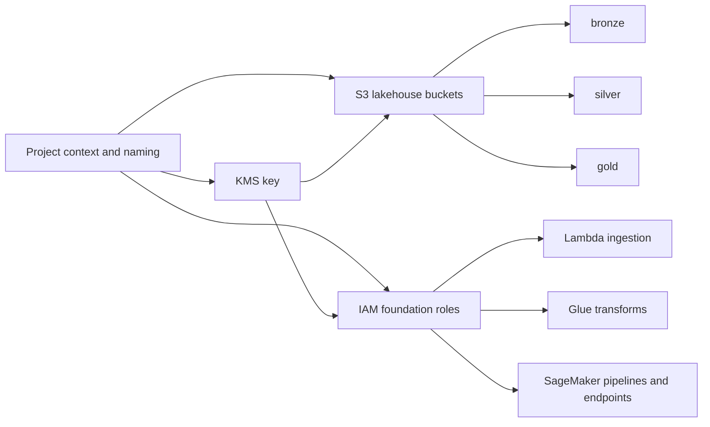

# AWS Real-Time Energy Forecasting and Anomaly Detection (IaC)

Terraform-first infrastructure for a production-style AWS MLOps project focused on near-real-time energy-demand forecasting, anomaly detection, and uncertainty estimation.

## Introduction
This repository scaffolds an AWS platform that ingests public electricity and weather data, lands it in a Bronze/Silver/Gold lakehouse on Amazon S3, and prepares the shared infrastructure needed for training, deployment, and monitoring with Amazon SageMaker.

The current implementation covers the foundation layer plus the first ingestion workload. It sets up the shared naming context, KMS encryption, S3 lakehouse buckets, IAM roles, an initial ingestion Lambda, helper scripts, and the repo structure that later transformation and ML resources will depend on.

## Real-World Use Case
Energy suppliers, grid operators, and operations teams need timely demand forecasts and anomaly alerts to support balancing decisions, planning, and incident response. A credible AWS portfolio project should show how raw public data can be ingested, standardized into a medallion architecture, and fed into forecasting and anomaly-detection services with strong security, automation, and observability.

## Best Architecture Choice
For v1, the most sensible design is near-real-time rather than fully streaming everywhere.

- `Amazon S3` for the Bronze, Silver, and Gold lakehouse
- `AWS KMS` for encryption of shared storage and downstream assets
- `Amazon Kinesis Data Streams` for event ingestion where streaming adds value
- `AWS Lambda` for lightweight ingestion and normalization
- `AWS Glue` for cataloguing and transformation jobs
- `Amazon SageMaker` for training pipelines, model registry, and inference endpoints
- `Amazon EventBridge Scheduler` for orchestration
- `Amazon CloudWatch` for platform and model alerting
- `Amazon Redshift Serverless` as an optional later analytics-serving layer

## Quick Start
1. Install prerequisites:
   - AWS CLI
   - Terraform (>= 1.5)
   - Python 3.10+

2. Authenticate to AWS with the AWS CLI:
If IAM Identity Center is not enabled for your account, create or use an IAM user access key in the AWS Console and then configure the CLI locally:

```powershell
aws configure
aws sts get-caller-identity
```

When prompted by `aws configure`, enter:
- `AWS Access Key ID`
- `AWS Secret Access Key`
- `Default region name`, for example `us-east-1`
- `Default output format`, for example `json`

3. Deploy the foundation layer and first ingestion Lambda:
```powershell
python scripts\deploy.py
```

This deploys the shared project context, KMS key, S3 lakehouse buckets, IAM foundation roles, and the first ingestion Lambda.

## Architecture Overview


## Resource Naming
Resources use a clear resource prefix followed by the environment and a generated random animal suffix, for example:

- `alias/kms-energyops-dev-quiet-otter`
- `dl-energyops-dev-quiet-otter`
- `iam-lambda-energyops-dev-quiet-otter`

The random animal suffix is created in the project context module and then propagated automatically to downstream resources through the deploy script.

## Project Structure
- `terraform/01_project_context`: Shared deployment context, tags, and generated naming suffix
- `terraform/02_kms`: AWS KMS key and alias for platform encryption
- `terraform/03_s3_lakehouse`: S3 buckets for lakehouse, artefacts, and monitoring
- `terraform/04_iam_foundation`: IAM roles and access policies for Lambda, Glue, and SageMaker
- `terraform/05_lambda_ingestion`: Ingestion Lambda and CloudWatch log group
- `terraform/06_eventbridge_scheduler`: Recurring scheduler that invokes the ingestion Lambda
- `lambda/ingestion`: Lambda source code package
- `scripts/`: Deploy and destroy helpers that auto-write `terraform.tfvars`
- `guides/setup.md`: Detailed setup guide
- `src/energy_forecasting/`: Python package scaffold for ingestion, transformation, ML, and orchestration
- `tests/`: Initial unit tests
- `.github/workflows/`: Starter CI workflow

## Foundation Modules
- `terraform/01_project_context`: Generates deployment naming context and standard tags
- `terraform/02_kms`: Creates the KMS key used by S3 and later ML assets
- `terraform/03_s3_lakehouse`: Creates the medallion-style buckets and starter prefixes
- `terraform/04_iam_foundation`: Creates the base execution roles for Lambda, Glue, and SageMaker
- `terraform/05_lambda_ingestion`: Creates the ingestion Lambda that fetches Elexon and Open-Meteo data into Bronze S3
- `terraform/06_eventbridge_scheduler`: Creates the EventBridge Scheduler cadence for the ingestion Lambda

Example variables files:
- `terraform/01_project_context/terraform.tfvars.example`
- `terraform/02_kms/terraform.tfvars.example`
- `terraform/03_s3_lakehouse/terraform.tfvars.example`
- `terraform/04_iam_foundation/terraform.tfvars.example`
- `terraform/05_lambda_ingestion/terraform.tfvars.example`
- `terraform/06_eventbridge_scheduler/terraform.tfvars.example`

## Phased Implementation Plan
1. Foundation layer: project context, KMS, S3, IAM
2. Ingestion layer: EventBridge, Lambda, Kinesis, source configs
3. Transformation layer: Glue catalog, Glue jobs, Bronze-to-Silver and Silver-to-Gold processing
4. ML layer: SageMaker pipelines, training jobs, model registry, endpoint
5. Monitoring layer: CloudWatch alarms, model monitoring, retraining triggers
6. Delivery layer: GitHub Actions CI/CD, environment promotion, optional Redshift Serverless

## Deploy/Destroy Options
Deploy:
```powershell
python scripts\deploy.py
python scripts\deploy.py --context-only
python scripts\deploy.py --kms-only
python scripts\deploy.py --s3-only
python scripts\deploy.py --iam-only
python scripts\deploy.py --lambda-only
python scripts\deploy.py --scheduler-only
```

Destroy:
```powershell
python scripts\destroy.py
python scripts\destroy.py --context-only
python scripts\destroy.py --kms-only
python scripts\destroy.py --s3-only
python scripts\destroy.py --iam-only
python scripts\destroy.py --lambda-only
python scripts\destroy.py --scheduler-only
```

## Guide
See `guides/setup.md` for the detailed setup and deployment flow.
