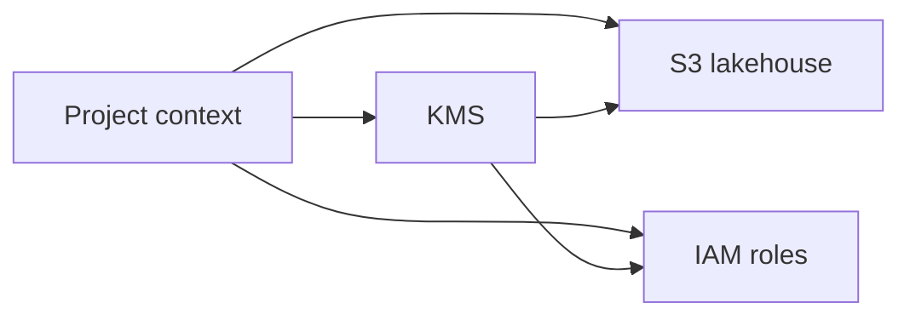

# Project Setup Guide

This guide covers the foundation layer and the first ingestion Lambda for the AWS energy forecasting and anomaly detection project.

## Prerequisites
- AWS CLI installed and authenticated
- Terraform installed (>= 1.5)
- Python 3.10+

## AWS CLI
Check your AWS CLI and authentication status:

```powershell
aws --version
aws sts get-caller-identity
```

If IAM Identity Center is not enabled for your account, configure the CLI with an IAM user access key:

```powershell
aws configure
aws sts get-caller-identity
```

When prompted by `aws configure`, enter:
- `AWS Access Key ID`
- `AWS Secret Access Key`
- `Default region name`, for example `us-east-1`
- `Default output format`, for example `json`

If you use named profiles:

```powershell
$env:AWS_PROFILE = "your-profile"
aws sts get-caller-identity
```

## Terraform Setup
Check if Terraform is installed and on `PATH`:

```powershell
terraform version
```

Install or update Terraform on Windows:

```powershell
winget install HashiCorp.Terraform
```

```powershell
choco install terraform -y
```

After installing, re-open PowerShell and re-run `terraform version`.

## Project Structure
- `terraform/01_project_context`: Shared deployment metadata, naming suffix, and standard tags
- `terraform/02_kms`: KMS key and alias
- `terraform/03_s3_lakehouse`: Data lakehouse, artefact, and monitoring buckets
- `terraform/04_iam_foundation`: Base roles for Lambda, Glue, and SageMaker
- `terraform/05_lambda_ingestion`: Ingestion Lambda and log group
- `terraform/06_eventbridge_scheduler`: Recurring schedule that invokes the ingestion Lambda
- `scripts/`: Helper scripts to deploy and destroy Terraform resources
- `guides/setup.md`: This guide
- `lambda/ingestion`: Lambda source code package
- `src/energy_forecasting/`: Python scaffold for ingestion, transformation, ML, and orchestration
- `tests/`: Initial unit tests

## Foundation Architecture


## Configure Terraform
The deploy script writes the live `terraform.tfvars` files automatically for:

- `terraform/01_project_context/terraform.tfvars`
- `terraform/02_kms/terraform.tfvars`
- `terraform/03_s3_lakehouse/terraform.tfvars`
- `terraform/04_iam_foundation/terraform.tfvars`

If you want different defaults, edit `DEFAULTS` in `scripts/deploy.py` or create a local `.env` file based on `.env.example`.

Example variables files:
- `terraform/01_project_context/terraform.tfvars.example`
- `terraform/02_kms/terraform.tfvars.example`
- `terraform/03_s3_lakehouse/terraform.tfvars.example`
- `terraform/04_iam_foundation/terraform.tfvars.example`
- `terraform/05_lambda_ingestion/terraform.tfvars.example`
- `terraform/06_eventbridge_scheduler/terraform.tfvars.example`

## Naming Strategy
The project context module generates a shared random animal suffix once, for example `quiet-otter`.
That suffix is reused across the foundation resources so they are easy to correlate:

- `energyops-dev-quiet-otter`
- `alias/kms-energyops-dev-quiet-otter`
- `dl-energyops-dev-quiet-otter`
- `iam-sagemaker-energyops-dev-quiet-otter`

## Deploy Resources
From the repo root, run:

```powershell
python scripts\deploy.py
```

Optional flags:

```powershell
python scripts\deploy.py --context-only
python scripts\deploy.py --kms-only
python scripts\deploy.py --s3-only
python scripts\deploy.py --iam-only
python scripts\deploy.py --lambda-only
python scripts\deploy.py --scheduler-only
```

## Destroy Resources
To tear down the foundation layer:

```powershell
python scripts\destroy.py
```

Optional flags:

```powershell
python scripts\destroy.py --context-only
python scripts\destroy.py --kms-only
python scripts\destroy.py --s3-only
python scripts\destroy.py --iam-only
python scripts\destroy.py --lambda-only
python scripts\destroy.py --scheduler-only
```

## Notes
- The scripts rely on Terraform outputs from earlier modules to keep manual configuration to a minimum.
- The S3 module creates starter prefixes for `bronze`, `silver`, `gold`, `feature_store`, `training`, `inference`, and `monitoring`.
- The IAM module currently creates execution roles for Lambda ingestion, Glue transformations, and SageMaker training or inference.
- The Lambda module packages `lambda/ingestion/app.py`, fetches Elexon and Open-Meteo payloads, writes the raw JSON into Bronze prefixes, and records an invocation manifest alongside them.
- The EventBridge Scheduler module invokes the ingestion Lambda on a fixed cadence and passes a lightweight JSON payload to each invocation.
- The current repository state includes the foundation layer plus the first ingestion Lambda. Streaming, orchestration, transformation, and model-serving resources come in later phases.
- Terraform state and generated `terraform.tfvars` files are gitignored by default.
